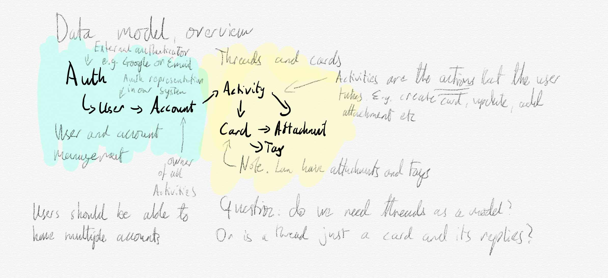

# The Data Model

<table>
  <tr>
    <th>Model</th>
    <th>Owns/Can act on</th>
    <th>Groups of</th>
    <th>References</th>
  </tr>
  <tr>
    <td>User</td>
    <td>Account, Auth/Email</td>
    <td>User Group*</td>
    <td>Auth/Email*</td>
  </tr>
  <tr>
    <td>Account</td>
    <td>Activity</td>
    <td>Shared Workspace*</td>
    <td>Email*</td>
  </tr>
  <tr>
    <td>Activity</td>
    <td>Cards</td>
    <td>Thread/Activity Stream</td>
    <td>Account</td>
  </tr>
  <tr>
    <td>Card</td>
    <td>Attachments, Tags, Replies (child Activities)</td>
    <td>Thread via parent Activity</td>
    <td>Parent Activity</td>
  </tr>
</table>

\* Discussed in the Sharing Model

## Activity Streams

The core data model for the app is based on [Activity Streams](https://www.w3.org/TR/activitystreams-core/) and the [Activity Streams Vocabulary](https://www.w3.org/TR/activitystreams-vocabulary/).

This is my second major attempt to build a knowledge management system that uses Activity Streams as its base data model.

The last time was a bust but I don't think that's due to the concept itself.

Most apps end up implementing some form of event streaming, if only to increase data storage redundancies. But using an activity stream as a core data model gives us a lot of options:

- It's an open standard. There are already apps and services that use it so there's familiarity out there.
- It makes implementing proper 'undo' much much simpler. You can essentially walk back the activity stream, one at a time.
- It makes implementing proper offline apps simpler down the line. You can use the event stream to maintain a local, live copy of all of the user's data.
- The activity stream vocabulary has the notions of Notes (what we will call Cards), Tags (not just tags, but also links), Attachments, Documents, and Actors (Users)
- It's notion of threads is an Activity and all of its replies.

## Note (Card)

The core of the note is the name, which could be stored either as plain text or Markdown or HTML or all of the above (whichever I settle on).

It can have attachments, links, tags, and a text body (again, in whichever format I decide on). It can also have `to`, `cc`, and `bcc` fields which will come into play in the sharing model.

## Attachment

This is a media object (image, website, ebook, document) that exists on our servers. When the time comes to implement offline support, the user should be able to have the system keep a local copy of it for offline use.

## Tag

This is any form of link. Can be a regular link, which serves as a bookmark. Could be a tag (which is a namespaced link) or colour or some other property that can be expressed as a typed link.

## Questions

What to do about bookmarks and archiving? One of the big use cases for bookmarking notes is annotation and archive copies. But properly archiving a website is resource and storage intensive. If Colophon defaults to archiving bookmarks then it's likely that storage costs will escalate which would lead to higher prices to the end user. If it doesn't default to archiving then annotation becomes trickier as it's much safer to annotate copies you 'own'.

Annotating a live site with a web service is doable via a live proxy but I have doubts about both the safety and ethics of providing such a service. (Hypothesis does it and it isn't the only disagreement I've had with Hypothesis folks about ethics and safety. IMO, the only thing that's preventing Hypothesis from being an abuse vector is that they are quite unpopular with mainstream users.) Making sure that it's a closed proxy, one that is only accessible to the user that bookmarks it, does mitigate a lot of my concerns as would stripping JS off the proxied site, but that's also likely to break most of them.

The issue with annotation, bookmarking, and archiving largely go away with native apps as they can embed a proper sandboxed WebView and add annotation tools to that but a native app would be far, far down the line. The app needs to first be financially viable as a web service before I would work on an app.
